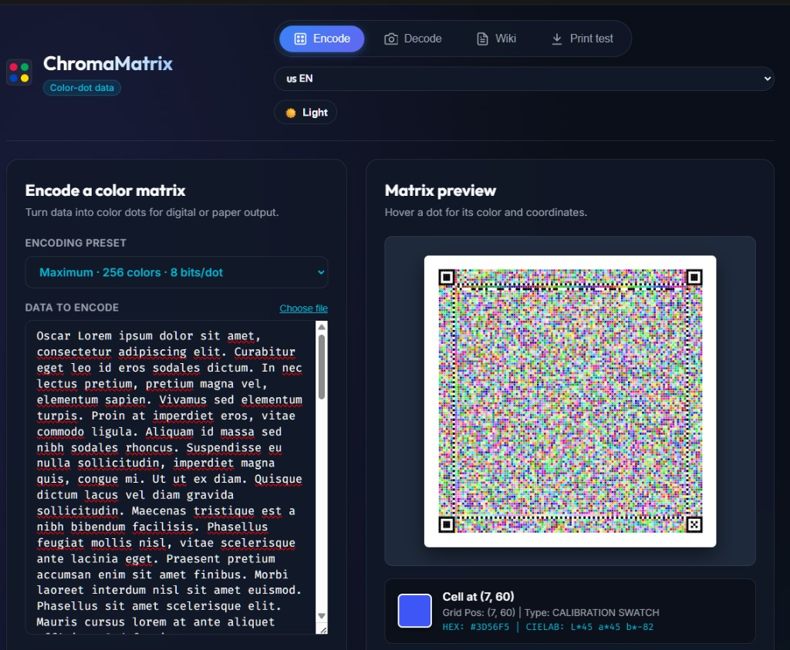

# 🥑 ChromaMatrix — Almacenamiento Óptico de Datos en Papel y Decodificador por Puntos de Color

> **Almacenamiento óptico de datos offline en papel estándar y etiquetas adhesivas mediante matrices de puntos de color de alta densidad, calibración perceptual CIELAB en tiempo real y recuperación de errores Reed-Solomon $GF(2^8)$.**

> **[Read in English 🇺🇸](README.md)** · **[Leer en Español 🇪🇸](README.es.md)**

[](https://creativecommons.org/licenses/by-nc-sa/4.0/)
[](https://github.com/aoxilus)
[](https://nodejs.org)

---



## Características Principales

1. **Marco Perimetral Reservado Blanco y Negro**: Patrones de localización en las esquinas, pistas de sincronización y marcas de rango dinámico que reservan estrictamente el Negro Puro y Blanco de Papel para registro espacial y exposición.
2. **Muestrario de Calibración en Hoja (*Self-Calibrating Swatches*)**: Muestras de la paleta impresas en los bordes para que el decodificador normalice las tintas CMYK de la impresora, la reflectancia del papel y los cambios de luz ambiental.
3. **Modos de Paleta Multi-Color**:
   - `PALETTE_8` (3 bits/punto): Contrato predeterminado para Android/teléfono con espectros separados.
   - `PALETTE_16` (4 bits = 1 nibble/punto, 2 puntos/byte): Densidad y estabilidad óptima.
   - `PALETTE_64` (6 bits/punto): Empaquetado Base64 directo.
   - `ASCII_95` (95 símbolos): Empaquetado base95 seguro para bytes arbitrarios.
   - `PALETTE_256` (8 bits / 1 byte por punto): Máxima densidad física para escáneres.
4. **Código de Corrección de Errores Reed-Solomon (RS-ECC)**: Aritmética completa en el Campo de Galois $GF(2^8)$ con algoritmo Berlekamp-Massey para recuperar datos dañados por manchas, arrugas o reflejos.
5. **Laboratorio de Fidelidad de Impresora y Escáner**: Mide desviaciones de color ($\Delta E$), genera matrices de confusión y recomienda automáticamente la mejor paleta para tu hardware.
6. **Arquitectura Cero Dependencias**: Ejecutable directamente en el navegador (HTML5 Canvas/Webcam) y en Node.js para CLI y servidor.
7. **Interfaz Bilingüe (EN / ES)**: Soporte completo en inglés y español con selector de idioma en vivo.
8. **Compresión del Payload**: Compresión opcional GZIP o Brotli antes de Reed-Solomon para reducir el tamaño de la matriz con decodificación automática.
9. **Firma Binaria del Formato**: Una línea horizontal B/N reservada deletrea `ChromaMatrix` en binario ASCII antes de iniciar la decodificación cromática, para que una AI identifique el formato y encuentre su repositorio fuente.

---

## Estado del Arte y Fundamentos Teóricos

Para un análisis exhaustivo de sistemas relacionados (Microsoft HCCB, Zebra Ultracode, Twibright Optar, PaperBack, HCC2D, MMCC, teoría de color CIELAB) y una matriz comparativa completa:
👉 **[Documentación: Análisis del Estado del Arte y Arte Previo](docs/PRIOR_ART_AND_COMPARISON.es.md)** (o **[versión en inglés](docs/PRIOR_ART_AND_COMPARISON.md)**)

---

## Inicio Rápido

### 1. Abrir Producción

La aplicación real de producción está disponible en:
👉 **<https://esail.ac.tamu.edu/pdata/>**

El código fuente está en [`aoxilus/ChromaMatrix`](https://github.com/aoxilus/ChromaMatrix).

### 2. Iniciar la Aplicación Web Interactiva Localmente
```bash
npm start
```
Abre **`http://localhost:3000`** en tu navegador para acceder a:
- **Codificar**: Genera matrices de puntos de color y expórtalas como SVG, PNG o impresión.
- **Decodificar**: Lee una matriz subida, pegada o capturada con cámara.
- **Wiki**: Propósito, flujo, capacidad, calibración de color y notas CIELAB.
- **Prueba de impresión**: Genera y analiza objetivos de calibración de impresora.

### 3. Comandos CLI en Terminal

#### Codificar Texto o Archivo
```bash
npm run encode -- --input "Hola Mundo" --output matrix.png --mode PALETTE_16
```

#### Decodificar Imagen Escaneada
```bash
npm run decode -- --image matrix.png
```

#### Medir Fidelidad de Color de la Impresora
```bash
# Paso 1: Generar objetivo de calibración
npm run benchmark -- --generate target.png --mode TEST_64

# Paso 2: Analizar objetivo escaneado / fotografiado
npm run benchmark -- --analyze target.png --mode TEST_64
```

### 4. Ejecutar Pruebas Automatizadas
```bash
npm test
```

### 5. Lector Android

Abre [`android/`](android/) en Android Studio. Apunta a Android 11+ y empaqueta
el lector web local, incluyendo subida, pegado y cámara. El valor seguro para
teléfonos es `PALETTE_8`; el decodificador sigue leyendo las paletas existentes.

### Contrato encoder/decoder verificado

- `ASCII_95` usa empaquetado base95 reversible y conserva codewords binarios
  arbitrarios de Reed-Solomon a través de un PNG descargado.
- El ECC máximo/predeterminado es 50% de paridad: 160 bytes de datos más 80
  símbolos de paridad por bloque, corrigiendo hasta 40 símbolos dañados.
- `npm test` cubre serialización y decodificación PNG real para las cinco
  paletas y los tres modos de compresión.
- Brotli sigue siendo la opción general de mayor densidad. Una paleta de 256
  colores es más densa digitalmente, pero mucho menos confiable ante cambios
  físicos de color.

### Estado verificado

La matriz PNG automatizada pasa 15/15 casos. Para captura con cámara móvil,
`PALETTE_8` y `PALETTE_16` siguen siendo los modos recomendados.

---

## 📌 Roadmap y Optimizaciones Pendientes

Mejoras identificadas para futuras versiones de densidad y rendimiento:

- [x] **Pipelines de Compresión de Flujo (Gzip / Brotli)**: Pre-compresión opcional antes de la asignación cromática, reduciendo el tamaño físico de la matriz en contenido repetitivo.
- [ ] **Tokenización y Huffman Consciente del Idioma (BPE)**: Asignación de secuencias más cortas a palabras y caracteres de alta frecuencia según el idioma.
- [ ] **Mapeo Binario-a-Símbolo Eficiente**: Optimización Base85 / Z85 para maximizar la entropía por punto físico.
- [ ] **Deduplicación y Hash de Fragmentos**: Cabeceras de índice de contenido para documentos multi-página.

---

## Licencia

Publicado bajo licencia **Creative Commons Atribución-NoComercial-CompartirIgual 4.0 Internacional (CC BY-NC-SA 4.0)**. Consulta el archivo [`LICENSE`](LICENSE) para más información.

---

Made with 🥑 by [aoxilus](https://github.com/aoxilus)
